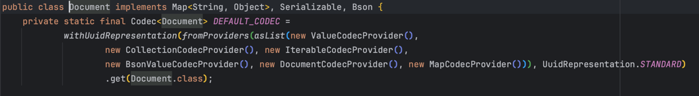
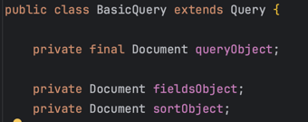

# 유스콘'24 발표자 오리엔테이션

목차 
1. [발표자 소개](#발표자-소개)
2. [발표 주제 : Kotlin으로 맞춤형 Mongo DSL 개발](#발표-주제--kotlin으로-맞춤형-mongo-dsl-개발)
    1. [발표 자료](#발표-자료)
    2. [개요](#개요)
    3. [QueryDSL Mongo, Criteria API 와 비교](#querydsl-mongo-criteria-api-와-비교)
        1. [QueryDSL Mongo](#querydsl-mongo)
        2. [Criteria API](#criteria-api)
        3. [MongoDB DSL](#mongodb-dsl)
    4. [사용법 및 특징](#사용법-및-특징)
        1. [타입 안정성](#타입-안정성)
        2. [가독성](#가독성)
           - [사용시 주의할 점](#사용시-주의할-점)
        3. [재사용성](#재사용성)
        4. [통계 쿼리 생성](#통계 쿼리 생성)
        5. [정렬](#정렬)
           - [정렬 문제 해결](#정렬-문제-해결)
3. [회고](#회고)

추가해야 할지 고민 되는 목차
- KotlinDSL에 대한 간단한 설명
- Kotlin Reflection API에 대한 간단한 설명
- 확장 함수 (extension method)에 대한 설명 및 간단한 예시
- 프록시에 대한 정말 정말 간단한 설명

지금 너무 정리가 잘 안되고 주절주절 되는 느낌이라 자연스럽게 흘러가도록 수정이 필요.

## 발표자 소개

안녕하세요. **개선**하는 것을 좋아하는 2년차 개발자 **정철희**입니다.  
**꾸준함**이라는 좋은 습관을 가지기 위해 퇴근 후에도 매일 코드를 작성하며 개선할 부분들을 찾아 리팩토링하는 것을 좋아합니다.    
저는 현재 **비유바움**이라는 회사에서 백엔드 개발자로 일하고 있으며 주로 **Kotlin**과 **Spring Boot**를 사용하여 정산 서비스를 개발, 운영하고 있습니다.  

## 발표 주제 : Kotlin으로 맞춤형 Mongo DSL 개발

### 발표 자료

발표 자료 소스 코드는 https://github.com/lolmageap/mongo-dsl 에서 확인하 실 수 있습니다.

### 개요

가장 먼저 MongoDB DSL을 만들게 된 계기와 목적을 설명하겠습니다.  
제가 있는 비유바움이라는 회사는 정산을 위한 결제 데이터를 MongoDB에 저장하고 있는데 저를 포함한 대부분의 팀원들이 MongoDB에 대한 이해도가 다소 부족했습니다.  
그래서 `MongoDB를 RDBMS ORM처럼 사용할 수 있을까?`라는 고민과 평소 DSL을 만들어보고 싶다는 생각이 겹쳐 MongoDB DSL을 만들게 되었습니다.  
또한 코틀린의 불변성, 중위 함수, 고차 함수를 접목하면 재밌겠다는 생각이 들어 무작정 만들었습니다.  
기능 자체는 저희 회사 프로젝트 성향에 맞춰서 필요한 부분만 구현했고 코드베이스적으로 많이 부족하지만 작은 도전이라고 생각하여 유스콘에 `Kotlin으로 커스텀 MongoDB DSL 만들어서 적용하기`라는 주제로 발표를 준비했습니다.    
이번 발표를 통해 동적으로 MongoDB의 쿼리를 가독성과 타입 안정성을 가진 DSL로 작성하는 방법과 만들면서 발생했던 문제를 어떻게 해결 했는지 대해 소개하고자 합니다.  

### TODO: KotlinDSL에 대해 간단하게라도 설명을 해야할지 고민 중...

### QueryDSL Mongo, Criteria API 와 비교

먼저 QueryDSL Mongo와 Criteria API를 소개하고 왜 이 두 라이브러리를 사용하지 않고 직접 DSL을 만들었는지에 대해 설명하겠습니다.   
예제로 사용할 코드는 Author Collection의 `name을 in 연산`, `nickname을 like 연산`, `age는 between 연산`하는 코드입니다.  

#### QueryDSL Mongo

QueryDSL Mongo는 많은 기능을 제공해주지만 설정이 복잡하고 레퍼런스가 생각보다 적었으며 Q파일 생성, 별도의 의존성을 추가해야 한다는 단점이 마음에 들지 않았습니다.  
또한 아주 복잡한 쿼리를 만들 때와 동적으로 쿼리를 만들 때 가독성이 떨어지기도 했습니다.  
QueryDSL Mongo는 predicate를 만들어서 재할당하는 방식을 사용하는데 불변성을 강조하는 Kotlin과 잘 어울리지 않다고 생각했습니다.  

```kotlin
fun findAuthors(
    names: List<String>,
    minAge: Int?,
    maxAge: Int?,
    nickname: String?,
): List<Author> {
    var predicate = author.name.`in`(names)

    if (minAge != null && maxAge != null) {
        predicate = predicate.and(author.age.gt(minAge).and(author.age.lt(maxAge)))
    } else {
        minAge?.let {
            predicate = predicate.and(author.age.gt(it))
        }
        maxAge?.let {
            predicate = predicate.and(author.age.lt(it))
        }
    }

    nickname?.let {
        predicate = predicate.and(author.nickname.contains(it))
    }

    return authorRepository.findAll(predicate)
}
```

#### Criteria API

QueryDSL Mongo에 이런 문제들 때문에 Criteria API를 사용하려고 했습니다.  
Criteria API는 복잡한 연산을 아주 잘 지원해주지만 타입 안정성과 가독성이 떨어진다는 문제가 있었습니다.  

```kotlin
fun findAuthors(
    names: List<String>,
    minAge: Int?,
    maxAge: Int?,
    nickname: String?,
): List<Author> {
    val criteriaList = mutableListOf<Criteria>()

    criteriaList.add(Criteria.where("name").`in`(names))

    if (minAge != null && maxAge != null) {
        criteriaList.add(Criteria.where("age").gt(minAge).lt(maxAge))
    } else {
        minAge?.let {
            criteriaList.add(Criteria.where("age").gt(it))
        }
        maxAge?.let {
            criteriaList.add(Criteria.where("age").lt(it))
        }
    }

    nickname?.let {
        criteriaList.add(Criteria.where("nickname").regex(it, "i"))
    }
    val query = if (criteriaList.isNotEmpty()) {
        val criteria = Criteria().andOperator(*criteriaList.toTypedArray())
        Query(criteria)
    } else {
        Query()
    }

    return mongoTemplate.find(query, Author::class.java)
}
```

#### MongoDB DSL

위 두 라이브러리를 사용하면서 느낀 단점들을 **개선**하고자 아래 예시처럼 직접 DSL을 구현했습니다.  
바로 위에서 소개했던 코드를 MongoDB DSL로 변환하면 아래와 같습니다.   

```kotlin
fun findAuthors(
    names: List<String>,
    nickname: String?,
    minAge: Int?,
    maxAge: Int?,
): List<Author> {
    val document = document {
        and(
            { field(Author::name) `in` names },
            { field(Author::age) between (minAge to maxAge) },
            { nickname?.let { field(Author::nickname) contains it } },
        )
    }

    return mongoTemplate.find(document, Author::class)
}
```

가독성과 타입 안정성 챙길 수 있게 KProperty1을 사용했으며 between 연산을 사용할 때 to 연산자를 사용했습니다.  
그리고 Kotlin에서 지원해주는 확장 함수 (extension method)을 활용해서 mongoTemplate에 java class를 넘기지 않고 Kotlin class를 넘길 수 있게 구현했습니다.  
TODO: KClass, KFunction, KProperty1과 같은 Kotlin Reflection API에 대한 설명을 간단하게 추가할지 고민 중...

### 사용법 및 특징

DSL의 구조는 생각보다 정말 단순합니다.  
`document` 함수를 호출하면 `DocumentScope`가 생성되고 `DocumentScope` 내부에서 `and`, `or`, `not`, `nor` 함수를 호출하여 `Document`를 만들 수 있습니다.  
복잡한 조건 연산을 수행할 수 있게 `and`, `or`, `not`, `nor` 함수 내에서 또 다른 `and`, `or`, `not`, `nor` 함수를 호출할 수도 있습니다.  

#### 타입 안정성

MongoDB DSL은 타입 안정성을 가지고 있습니다.  
예를 들어 Author 클래스가 아래와 같이 정의되어 있다고 가정해보겠습니다.

```kotlin
@Document
class Author(
    @Id @Field("_id")
    val id: String,
    val name: String,
    val age: Int,
    val weight: Double,
    val height: Float,
)
```

아래와 같이 쿼리를 작성 할 때 타입 안정성을 챙길 수 있습니다.  
criteria API를 사용할 때처럼 문자열로 필드명을 작성할 필요가 없고 KProperty1을 사용하여 타입 안정성을 챙길 수 있습니다.

```kotlin
val basicQuery = document {
    and(
        { field(Author::name) eq "정철희" },
        { field(Author::age) eq 25 },
        { field(Author::weight) eq 70.0 },
        { field(Author::height) eq 180.0f },
    )
}
```

아래 예시처럼 잘못된 타입을 넣으면 컴파일 에러가 발생합니다.

```kotlin
val basicQuery = document {
    and(
        { field(Author::name) eq "정철희" },
        { field(Author::age) eq "25" }, // 컴파일 에러
        { field(Author::weight) eq 70.0 },
        { field(Author::height) eq 180.0f },
    )
}
```

#### 가독성
이름이 정철희이고 나이가 25살 이상이며 번호가 010-1234-5678인 조건을 모두 만족하거나 이름이 정원희이고 나이가 30살 이상이며 번호가 010-5678-1234인 조건을 만족하는 쿼리를 작성하면 아래와 같이 작성할 수 있습니다.  
보기 쉽게 : ( 이름 == 정철희 and 나이 == 25 and 번호 == 010-1234-5678 ) or ( 이름 == 정원희 and 나이 == 30 and 번호 == 010-5678-1234 )
TODO: 그림 그려서 설명해도 괜찮을듯?

```kotlin
val basicQuery = document {
    or(
        {
            and(
                { field(Author::name) eq "정철희" },
                { field(Author::age) eq 25 },
                { field(Author::phone) eq "010-1234-5678" },
            )
        },
        {
            and(
                { field(Author::name) eq "정원희" },
                { field(Author::age) eq 23 },
                { field(Author::phone) eq "010-5678-1234" },
            )
        },
    )
}

basicQuery shouldBe BasicQuery(
    "{ \"\$or\" : [ " +
        "{ \"\$and\" : [ { \"name\" : \"정철희\" }, { \"age\" : 25 }, { \"phone\" : \"010-1234-5678\" } ] }, " +
        "{ \"\$and\" : [ { \"name\" : \"정원희\" }, { \"age\" : 23 }, { \"phone\" : \"010-5678-1234\" } ] } " +
    "] }"
)
```

##### 사용시 주의할 점



위 코드를 보면 아시겠지만 Document 객체는 Map 객체를 상속 받은 클래스이기 때문에 동일한 key가 중복되면 덮어 씌워지게 됩니다.  
그래서 하나의 함수 스코프 내에서 동일한 key를 사용하면 이후 값으로 덮어씌워지는 문제가 발생합니다.  

```kotlin
val basicQuery = document {
    and(
        {
            field(Author::name) eq "정철희"
            field(Author::name) eq "정철희 아님"
        },
    )
}

// expected
basicQuery shouldBe BasicQuery("{ \"\$and\" : [ { \"name\" : \"정철희\" }, { \"name\" : \"정철희 아님\" } ] }")

// actual
basicQuery shouldBe BasicQuery("{ \"\$and\" : [ { \"name\" : \"정철희 아님\" } ] }")
```

이러한 문제를 해결하기 위해 아래처럼 별도의 조건을 넘길 때 항상 함수 스코프를 넘겨서 새로운 객체를 생성하도록 컨벤션을 수정했습니다.  

```kotlin
val basicQuery = document {
    and(
        { field(Author::name) eq "정철희" },
        { field(Author::name) eq "정철희 아님" },
    )
}

// success
basicQuery shouldBe BasicQuery("{ \"\$and\" : [ { \"name\" : \"정철희\" }, { \"name\" : \"정철희 아님\" } ] }")  
```

내부 코드를 보면 이해가 되시겠지만 조금 상세하게 설명하겠습니다.  
함수식을 하나 넘길 때 마다 새로운 Document 객체를 생성하고 그 객체를 참조하도록 수정했습니다.   
최상단 Document의 키는 $and 조건이 되고 value는 Document 객체의 리스트가 됩니다.  
이 컨벤션만 지킨다면 기존 값을 덮어쓰지 않고 새 Document 객체에 추가하여 이어붙일 수 있습니다.  
참고로 Kotlin에서는 함수도 디컴파일 시 익명 클래스로 변환되기 때문에 제네릭 타입의 매개변수로 함수를 넘기는 것이 가능합니다.  

```kotlin
class DocumentOperatorBuilder(
    val document: Document,
) {
    fun and(
        vararg block: Document.() -> (Document),
    ): Document {
        val nonEmptyBlocks = applyNotEmptyFunctions(block)

        return if (nonEmptyBlocks.isNotEmpty()) document.append(AND, nonEmptyBlocks)
        else document
    }

    private fun applyNotEmptyFunctions(
        block: Array<out Document.() -> Document>,
    ): List<Document> = block.mapNotNull {
        val doc = Document().it()
        doc.ifEmpty { null }
    }
}
```

#### 재사용성

가끔 코드를 작성하게 되면 비슷한 쿼리를 여러번 사용해야 할 때가 있습니다.  
그때 동일한 조건을 재사용할 수 있게도 구현해봤습니다.  

```kotlin
val originalQuery = document {
    and(
        { field(Author::name) eq "정철희" },
        { field(Author::age) eq 25 },
    )
}

val weightQuery = originalQuery.where { field(Author::weight) gt 62.0 }
val heightQuery = originalQuery.where { field(Author::height) lt 170f }

weightQuery shouldBe BasicQuery("{ \"\$and\" : [{ \"name\" : \"정철희\"}, { \"age\" : 25}, { \"weight\" : {\"\$gt\" : 62.0}}]}")
heightQuery shouldBe BasicQuery("{ \"\$and\" : [{ \"name\" : \"정철희\"}, { \"age\" : 25}, { \"height\" : {\"\$lt\" : 170.0}}]}")
```

#### 통계 쿼리 생성

grouping을 사용하면 sum, avg, min, max, count 등 다양한 통계 쿼리를 생성할 수 있습니다.  
아래 코드는 grouping 대상을 명시하진 않아 조건에 맞는 Author 나이의 전체 합을 구하는 코드입니다.  

```kotlin
val basicQuery = document {
    and(
        { field(Author::name) eq "정철희" },
    )
}

val aggregate = basicQuery.sumOf { field(Author::age) }
mongoTemplate.sumOfSingle(basicQuery, Author::class)
```

grouping을 명시하면 아래와 같이 group 별로 통계 쿼리를 생성할 수 있습니다.  
그리고 만약 mongodb collection에 field가 string 타입이어도 숫자로 형변환하여 계산하는 것도 가능합니다.  

```kotlin
val basicQuery = document {
    and(
        { field(Author::name) eq "정철희" },
    )
}

val aggregate = basicQuery.groupBy(Author::age).sumOf(Double::class) { field(Author::phone) }
mongoTemplate.sumOfGroup(basicQuery, Author::class)
```

#### 정렬

정렬은 orderBy 함수를 사용하면 됩니다.  

```kotlin
val basicQuery = document {
    and(
        { field(Author::name) eq "정철희" },
    )
}.orderBy(Author::age).desc()
```

아래처럼 여러 필드를 정렬할 수도 있습니다.  

```kotlin
val basicQuery = document {
    and(
        { field(Author::name) eq "정철희" },
    )
}.orderBy(Author::age).desc()
    .orderBy(Author::phone).asc()
```

Order 객체 내부 소스 코드입니다.  
정렬 부분에 소스 코드도 **불변성**을 지키기 위해 노력하면서 구현했습니다.  

```kotlin
data class Order(
    val basicQuery: BasicQuery,
    val key: KProperty1<*, *>,
) {
    fun asc() = basicQuery.sorting(Sort.Direction.ASC)
    fun desc() = basicQuery.sorting(Sort.Direction.DESC)

    private fun BasicQuery.sorting(
        direction: Sort.Direction,
    ): BasicQuery {
        val document = this.queryObject.copy()
        val existingSort = this.extractSortObject()
        val newSort = Sort.by(direction, key.name)
        val combinedSort = existingSort.and(newSort)
        val newBasicQuery = BasicQuery(document)
        newBasicQuery.with(combinedSort)
        return newBasicQuery
    }

    private fun BasicQuery.extractSortObject() =
        Sort.by(
            this.sortObject.entries.map {
                val sort = when (it.value) {
                    ASC -> Sort.Direction.ASC
                    else -> Sort.Direction.DESC
                }
                Sort.Order(sort, it.key)
            }
        )

    companion object {
        private const val DESC = "-1"
        private const val ASC = "1"
    }
}
```

##### 정렬 문제 // 정렬 시 문제를 먼저 설명하고 해결한 방법을 설명할지 고민...

만약 불변성을 지키지 않았다면 어떤 문제가 있었을까요?  // TODO: 프록시 개념에 대한 설명 추가 고민 중... 
문제가 발생했던 이전 소스 코드 예시도 함께 준비했습니다.

> 문제가 발생한 이전 소스 코드
```kotlin
data class Order(
    val basicQuery: BasicQuery,
    val key: KProperty1<*, *>,
) {
    fun asc(): BasicQuery {
        basicQuery.with(
            Sort.by(Sort.Direction.ASC, key.name)
        )
        return basicQuery
    }

    fun desc(): BasicQuery {
        basicQuery.with(
            Sort.by(Sort.Direction.DESC, key.name)
        )
        return basicQuery
    }
}
```

간단하게 설명한다면 기존에는 BasicQuery를 매개변수로 받아서 BasicQuery에 정렬을 추가하고 반환하는 방식으로 구현했습니다.  

> 문제가 발생한 이전 코드의 테스트 코드
```kotlin
val originalBasicQuery = document {
    and(
        { field(Author::name) eq "정철희" },
    )
}

val firstBasicQuery = originalBasicQuery.orderBy(Author::age).desc()
val secondBasicQuery = originalBasicQuery.orderBy(Author::phone).asc()

// 기대한 값
firstBasicQuery shouldBe BasicQuery("{ \"\$and\" : [ { \"name\" : \"정철희\" } ] }", "{ \"age\" : -1 }") // error

// 실제 값
firstBasicQuery shouldBe BasicQuery("{ \"\$and\" : [ { \"name\" : \"정철희\" } ] }", "{ \"age\" : -1, \"phone\" : 1 }") // success
```

originalBasicQuery에 정렬을 추가해서 firstBasicQuery와 secondBasicQuery를 각각 생성했습니다.  
그런데 secondBasicQuery를 생성할 때 firstBasicQuery의 sortObject도 함께 변경되는 문제가 발생했습니다.  

Q. 왜 위와 같은 문제가 발생할까요?  
A. 해당 문제는 BasicQuery 클래스 내부에서 queryObject, fieldsObject와 sortObject가 Document 클래스 동일하게 바라보고 있기 때문에 발생했습니다.  



이로 인해 secondBasicQuery를 orderBy 함수로 생성할 때 originalBasicQuery 인스턴스 내부의 sortObject가 동일한 메모리 주소를 참조하게 되어 firstBasicQuery의 sortObject도 함께 변경되는 문제가 발생합니다.  
그림으로 보면 아래처럼 originalBasicQuery, firstBasicQuery, secondBasicQuery 가 동일한 메모리 주소를 참조하게 되는 문제가 발생합니다.  

// TODO: 여기 그림 그려서 넣어야함.

이 문제를 해결하기 위해 내부적으로 copy() 함수를 구현하여 새로운 Document 객체를 생성하고 BasicQuery는 각각 새로 생성된 Document 객체를 참조하도록 수정했습니다.  

## 회고

혼자 만든 DSL이지만 컨벤션에 일관성이 없는 부분이나 불필요한 코드가 많은 부분이 있어서 조금 더 리팩토링이 필요하다고 생각합니다.  
아직 기능적으로 많이 부족해서 aggregate 관련된 기능을 더 많이 지원해보고 싶다는 생각을 하고 있습니다.  
마무리로 `왜 JVM, SPRING 진영은 MongoDB에 대한 ORM이나 DSL이 별로 없고 있어도 왜 지원을 잘 안해줄까?` 라는 생각으로 시작했지만 개발 중간에 `아 없을만 하다` 라는 생각으로 바뀌었습니다....!!!  